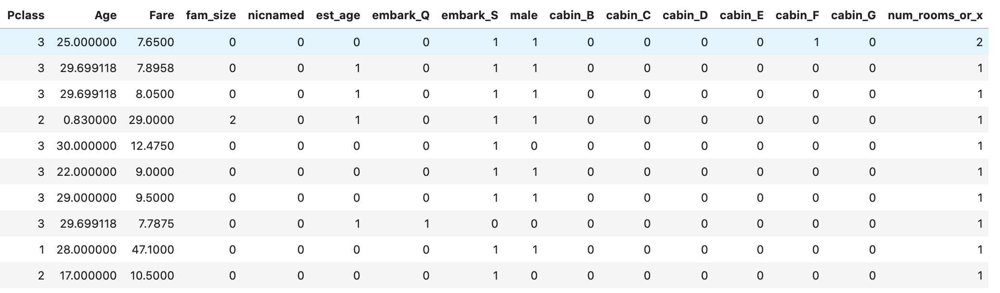

# [Titanic Survivors - Kaggle Competition](https://www.kaggle.com/c/titanic)
## Breaking top 4%

[Code Walkthrough](Walkthrough.ipynb)

I used the [XGBoost Python Package](https://xgboost.readthedocs.io/en/latest/index.html)

Some of the features I engineered:

- __num_rooms:__ If a passenger has multiple entries in their 'Cabin' field, they apparently had more than one room booked. I created a feature of how many rooms a person had.

  such as this person:

  ```
  PassengerId                                28
  Survived                                    0
  Pclass                                      1
  Name           Fortune, Mr. Charles Alexander
  Sex                                      male
  Age                                        19
  SibSp                                       3
  Parch                                       2
  Ticket                                  19950
  Fare                                      263
  Cabin                             C23 C25 C27
  Embarked                                    S
  ```

- __est_age__: on Kaggle, it mentions that if a person's age ends in .5, that means their age was estimated. I turned that into a feature as well

- __nicnamed__: some people have nicknames listed in their 'Name' field. I created a binary feature to indicated if the person is nick-named.

  Like Miss. Anna McGowan here:
  ```
  PassengerId                             23
  Survived                                 1
  Pclass                                   3
  Name           McGowan, Miss. Anna "Annie"
  Sex                                 female
  Age                                     15
  SibSp                                    0
  Parch                                    0
  Ticket                              330923
  Fare                                8.0292
  Cabin                                  NaN
  Embarked                                 Q
  ```

- __fam_size__: I combined the 'SibSp' and 'Parch' fields. Like Mr. Charles Alexander Fortune (shown in the num_rooms explanation), has 3 siblings on board with him, and 2 parents. So he has 5 family members on board.

- __cabin_class__: Simply pulling the letter out of their 'Cabin' field to create a categorical variable.

- __num_rooms_or_x__: Looking at correlation between pairs of features, naturally if the 'Cabin' field was missing data, 'num_rooms' and 'cabin_X' would encode the same every-time, so I simply added them together to create one feature.


Here is the result of the data preparations:



__Training an XGBClassifier ([train_predict.py](train_predict.py)) with this data and predicting on test.csv results in an accuracy of 80.62% which is the top 4% of all submissions :)__


